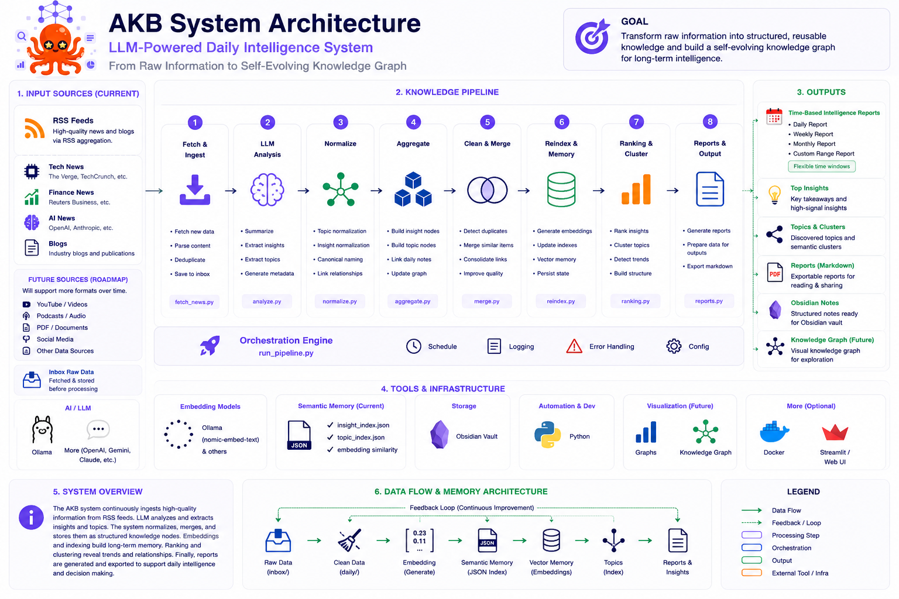

# 🧠 LLM-Powered Daily Intelligence System — AKB (Automatic Knowledge Base)


A self-evolving knowledge graph powered by LLMs + embeddings.

AKB continuously transforms raw information into structured, reusable, and evolving intelligence.

Instead of generating temporary AI outputs, the system builds persistent semantic memory through:

- LLM reasoning (Ollama / Gemini)
- Embedding-based memory
- Topic normalization
- Semantic deduplication
- Auto-merging
- Knowledge clustering
- Graph-based organization

```text
Raw Information
        ↓
LLM Extraction
        ↓
Semantic Normalization
        ↓
Embedding Memory
        ↓
Knowledge Graph Evolution
```

AKB is not just an AI summarization tool.

It is a long-term intelligence and memory system.

---

# ❓ Why Use This?

Tired of spending hours reading endless news and articles just to keep up with trends?

AKB is built for that.

Most AI tools generate temporary answers.

AKB builds persistent intelligence.

Instead of producing one-time summaries, the system continuously transforms raw information into a self-evolving semantic knowledge graph powered by LLMs + embeddings.

It can:

- summarize massive information streams
- normalize concepts over time
- merge duplicated knowledge
- preserve semantic relationships
- cluster related ideas
- accumulate long-term intelligence

```text
RSS / Information
        ↓
LLM Extraction
        ↓
Embedding Memory
        ↓
Semantic Knowledge Graph
```

This is not just AI summarization.

It is an evolving intelligence system.

---

# 🚀 Architecture



---

# 🔄 Execution Flow

```text
fetch
  ↓
init
  ↓
summarize
  ↓
topic normalize
  ↓
insight normalize
  ↓
aggregate
  ↓
clean
  ↓
merge
  ↓
reindex
  ↓
ranking
  ↓
cluster-topics
  ↓
reports
```

---

# 🚀 Quick Start

## 1. Clone Project

```bash
git clone <your-repo-url>

cd llm-powered-daily-intelligence-system
```

---

## 2. Install Dependencies

```bash
pip install -r requirements.txt
```

---

## 3. Setup `.env`

Create `.env`

```env
OLLAMA_HOST=http://localhost:11434

OLLAMA_EMBED_MODEL=nomic-embed-text

REPORT_PROVIDER=ollama
REPORT_MODEL=llama3
```

---

## 4. Configure RSS Sources

Edit:

```text
configs/sources.yaml
```

---

## 5. Start Ollama

```bash
ollama serve
```

Pull embedding model:

```bash
ollama pull nomic-embed-text
```

(Optional)

```bash
ollama pull llama3
```

---

## 6. Run Full Pipeline

```bash
python3 src/run_pipeline.py \
  --fetch \
  --init \
  --execution-analysis-backend ollama \
  --agg \
  --clean \
  --merge \
  --reindex \
  --ranking \
  --cluster-topics \
  --reports-backend ollama
```

---

# ✅ Generated Output

After execution, the system generates:

```text
inbox/
daily/
insights/
topics/
reports/
state/
```

---

# 📊 Generate Reports Only

```bash
python3 src/run_pipeline.py \
  --reports-backend ollama \
  --reports-granularity all
```

Supported granularities:

```text
day
week
month
all
```

---

# 🧪 Run Tests

```bash
pytest
```

---

# ⚡ Partial Pipeline Runs

## Only Fetch RSS

```bash
python3 src/run_pipeline.py --fetch
```

---

## Only Run LLM Analysis

```bash
python3 src/run_pipeline.py \
  --execution-analysis-backend ollama
```

---

## Rebuild Embedding Memory

```bash
python3 src/run_pipeline.py --reindex
```

---

## Merge Similar Insights

```bash
python3 src/run_pipeline.py \
  --merge \
  --merge-apply
```

---

## Generate Reports

```bash
python3 src/run_pipeline.py \
  --reports-backend ollama
```

---

# 🧩 Direct Scripts

## Fetch RSS News

```bash
python3 src/fetch_news.py \
  --date 2026-05-21
```

Output:

```text
inbox/2026-05-21.md
```

---

## Aggregate Insights

```bash
python3 src/aggregate_insights.py \
  --date 2026-05-21
```

Generates:

```text
insights/*.md
topics/*.md
```

---

## Generate Reports Directly

### Template Provider

```bash
python3 src/generate_reports.py \
  --granularity day \
  --date 2026-05-21 \
  --provider template
```

---

### Ollama Provider

```bash
python3 src/generate_reports.py \
  --granularity month \
  --provider ollama
```

---

## Optional Report Arguments

```bash
--dry-run
--include-mtime
--max-items
--max-chars-per-item
```

Example:

```bash
python3 src/generate_reports.py \
  --granularity all \
  --provider ollama \
  --max-items 50 \
  --include-mtime
```

---

# 📂 Output Files

## Inbox

Raw RSS ingestion:

```text
inbox/YYYY-MM-DD.md
```

Example:

```text
inbox/2026-05-21.md
```

---

## Daily Notes

LLM-generated daily analysis:

```text
daily/YYYY-MM-DD.md
```

Example:

```text
daily/2026-05-21.md
```

---

## Insight Nodes

Reusable semantic knowledge:

```text
insights/*.md
```

Example:

```text
insights/openai-launches-new-model.md
```

---

## Topic Nodes

Canonical topic entities:

```text
topics/*.md
```

Example:

```text
topics/artificial-intelligence.md
```

---

## State Files

Embedding memory indexes:

```text
state/insight_index.json
state/topic_index.json
```

---

## Reports

Generated summaries and rankings:

```text
reports/
```

Structure:

```text
reports/daily/
reports/weekly/
reports/monthly/
reports/all/
```

Examples:

```text
reports/daily/2026-05-21.md

reports/weekly/2026-W21.md

reports/monthly/2026-05.md

reports/all/global_summary.md
```

---

## Ranking Outputs

Generated ranking files:

```text
reports/top_insights.md
reports/topic_clusters.md
```

---

## Obsidian Knowledge Graph

Final semantic structure:

```text
daily/  ↔  insights/  ↔  topics/
```

Using wiki-links:

```text
[[insights/example]]
[[topics/example]]
```

---

# 🧠 Intelligence Layer

The system continuously evolves through:

```text
normalize
    ↓
merge
    ↓
memory
    ↓
clustering
    ↓
synthesis
```

This transforms isolated information into persistent semantic intelligence.

---

# 🧠 Hybrid Topic System

Topics are neither fully manual nor fully AI-generated.

```text
LLM
  ↓
propose topics
  ↓
embedding similarity matching
  ↓
existing topic found?
      ├─ yes → reuse topic
      └─ no  → create new topic
```

---

# 🧠 Design Philosophy

- LLM proposes
- Embeddings decide
- The system enforces consistency
- Knowledge evolves over time

---

# 🎯 Key Insight

```text
This is not a note-taking system.

It is a self-evolving knowledge graph.
```

---

# 🧠 Core Concepts

```text
embedding = semantic similarity engine

index = long-term memory

merge = repair duplicated knowledge

reindex = rebuild semantic memory

normalize = enforce canonical naming
```

---

# 🏁 Summary

```text
LLM → suggest

embeddings → decide

system → evolve
```

---

# 📌 Final Vision

```text
Raw Information
        ↓
Structured Knowledge
        ↓
Persistent Memory
        ↓
Semantic Intelligence
        ↓
Self-Evolving Knowledge Graph
```